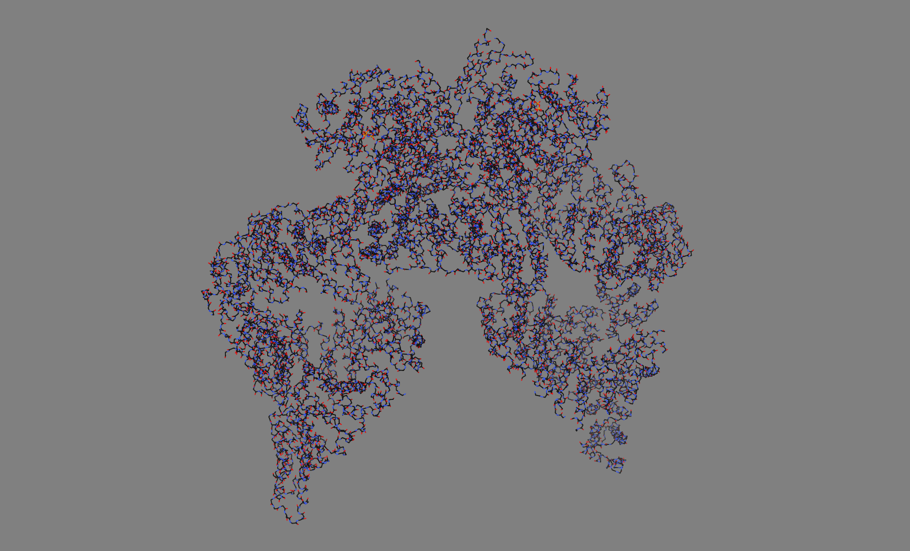

# Домашнее задание 3

### Визуализация структуры белка

Выбранная программа - ChimeraX

Выбранный белок - [6S8F](https://www.rcsb.org/structure/6s8f)

## Выбор раскраски визуализации

Сразу осле открытия скачанного файла, визуализация выглядела так:

Белок состоит из двух по-разному повёрнутых цепей, которые по умолчанию были серыми, немного разных оттенков. Белки из раздела `Get started` были изначально красочными.

Если попытаться изменить цвет текущей модели, меняется цвет сразу всех атомов. Чтобы раскрасить цепи, можно ввести команду `split #1`, после чего в панели моделей появятся разные цепи.

Чтобы включить раскраску по типам элементов, нужно на вкладке `Molecule Display` выбрать `heteroatom`. Атомы углерода останутся того же цвета, что была вся их цепь. 

По стандарту CPK углерод должен быть чёрным или серым. Чтобы соблюсти это, но различать цепи, просто понизим яркость и насыщенность цветов до 25. А также поменяем цвет фона на (светло-)серый.

## Способы визуализации

Чтобы сохранить картинку, нужно выбрать `Home -> Save` и увеличить разрешение в 2 раза.

### Wireframe

1. Вкладка `Molecule display` - включить `Stick` 
2. Нажать в верхнем меню `Actions -> Atoms/Bonds -> Chain Trace Only`

### Backbone

1. Вкладка `Molecule display` - включить `Stick` 
2. Нажать в верхнем меню `Actions -> Atoms/Bonds -> Backbone Only`

### Spacefill

`Molecule display` - `Sphere` 

### Ribbons

1. `Molecule display` - `Atoms` - `Hide`
2. `Molecule display` - `Cartoons` - `Show`

### Molecular surface

`Molecule display` - `Surfaces` - `Show`

## Визуализация публикационного качества

